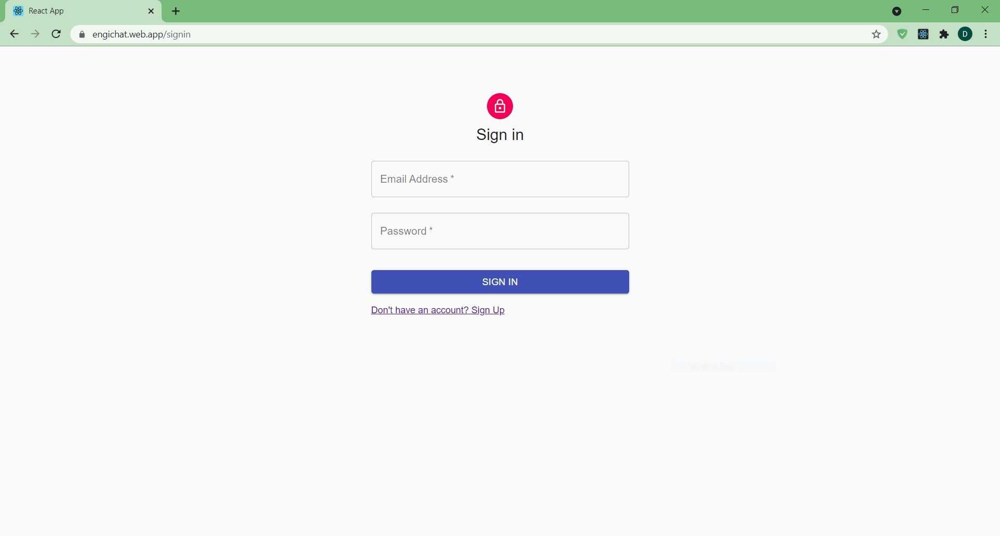
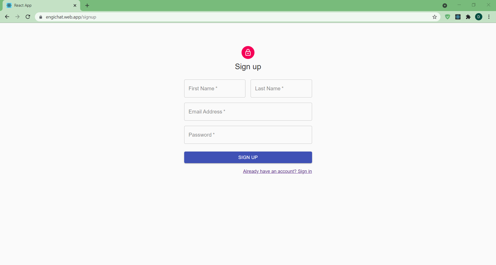
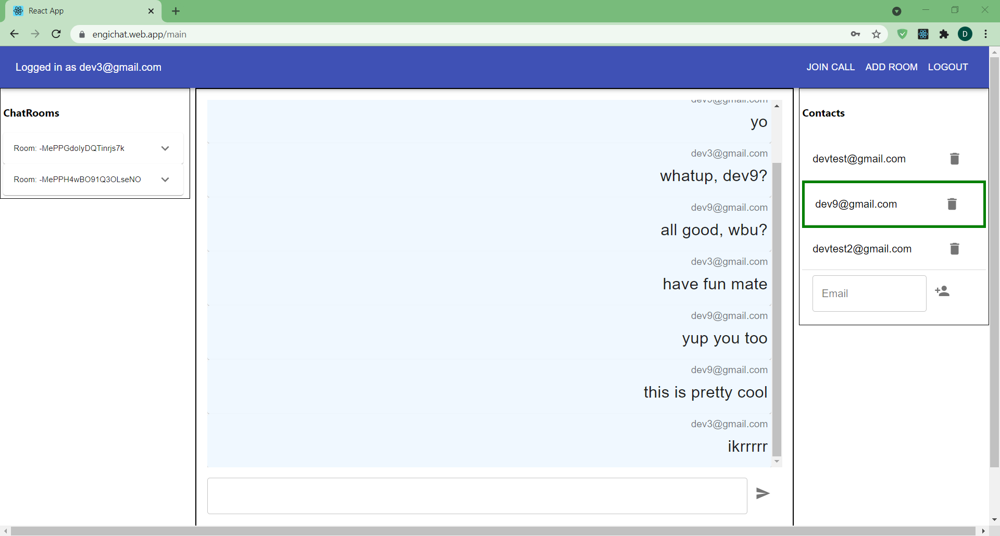

# engichat

Engichat is a Microsoft teams clone written in react with a backend of firebase.
It uses web-rtc for video calling, and firebase is also used as a signalling server.
This project was devloped for the Microsoft engage program.

## Build Instructions

1. Download the firebase config for your web app and export it as firebaseConfig in src/services/firebaseConfig.js
2. Setup email authorization in firebase
3. Enable firebase realtime database
4. Install dependencies by `npm install --save`
5. run `npm start`

## Innovative Idea

We can make this in a platform for dveloping social colaborative apps and games. For that we need to create an SDK that exposes several things, like the number of people in a call, a way to change the layout of participants, a way to acces video, etc. This could allow developers to make collaborative apps and games around the video call feature.
One example could be an AR competitive dancing game.

## Screenshots

### Signin

### Signup

### Chats

### VideoCall

## Cross-platform

Technically the app can work on all browsers which support webrtc, but it has only been tested on Chrome and Firefox on Windows, so there might be UI artifacts on other platforms.
